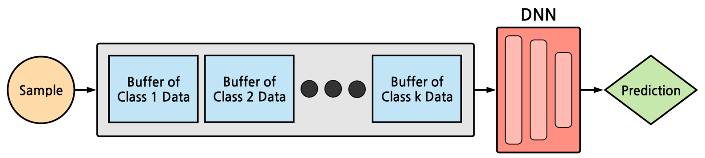
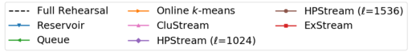
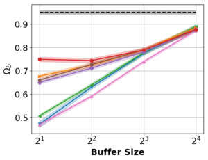
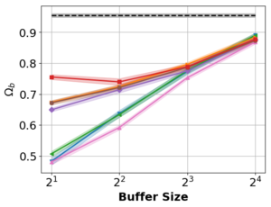

Memory Efficient Experience Replay for Streaming Learning
=====================================
This is a PyTorch implementation of the Exemplar Streaming (ExStream) algorithm from our ICRA-2019 paper. An [arXiv pre-print](https://arxiv.org/abs/1809.05922) and the [published version](https://ieeexplore.ieee.org/document/8793982) of our paper are available.


## Method


## Dependences 
- Python 3.5, PyTorch 1.0.0, NumPy, SciPy, scikit-learn, NVIDIA GPU
- **Dataset:** 
  - CUB-200 -- ResNet-50 embeddings (included in `cub200_resnet`)
   version  version 
  
## Usage
To generate results for the CUB-200 experiment with capacities [2,4,8,16] for the iid and class iid data orderings:
- `python run_exstream_experiment.py`

To generate plots for each of the experimental results:
- `python plot_results.py`

## Implementation Notes
Our original paper used class-specific buffers for storing exemplars. In this implementation, you can maintain class-specific buffers by setting the `buffer_type parameter` to `class`; we also give the option to maintain a single buffer that will fill to full capacity and then begin replacement/merging by setting the `buffer_type` parameter to `single`

## Results

### CUB-200 - iid


### CUB-200 - class iid


## References 
- \[1\] 'The Caltech-UCSD Birds-200-2011 Dataset.' by C. Wah, S. Branson, P. Welinder, P. Perona, and S. Belongie, http://www.vision.caltech.edu/visipedia/CUB-200-2011.html

## Citation
If using this code, please cite our paper.
```
@inproceedings{hayes2019memory,
  title={Memory Efficient Experience Replay for Streaming Learning},
  author={Hayes, Tyler L and Cahill, Nathan D and Kanan, Christopher},
  booktitle={International Conference on Robotics and Automation (ICRA)},
  year={2019},
  organization={IEEE}
}